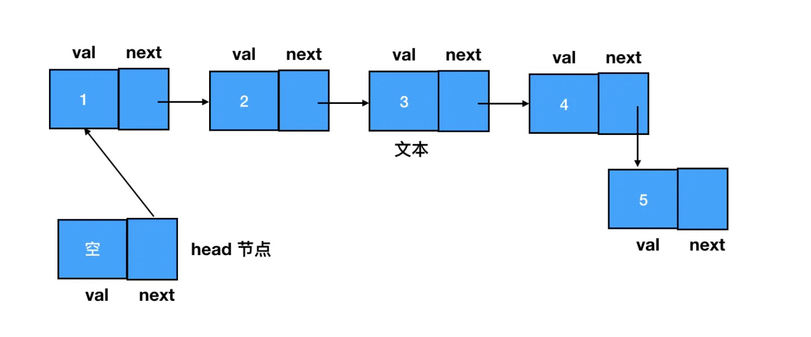

## 链表

参考书籍
  - [《前端算法与数据结构面试：底层逻辑解读与大厂真题训练》](https://juejin.im/book/5cb42609f265da035f6fcb65/section/5cf5e2805188253a2b01cbcc)

#### 1.什么是链表？
  链表和数组有相似之处。

  **相同点**：它们都是有序的列表、都是线性结构的（有且仅有一个前驱，有且仅有一个后继）。

  **不同点**：在数组中，是一段连续的内存空间，数据单位的名称叫做元素，元素和元素之间是紧密相连的。在链表中，数据单位的名称叫做结点，结点和结点的分布可以是离散的，链表中的结点可以散落在内存空间的各个角落。

> 注意：在js中，并非所有的数组都是一段连续的内存空间。（最后会详细说到）


#### 2.链表的结构
我们都知道，获取数组中的元素我们可以直接通过下标索引来获取。这是因为：数组中的元素是连续存在的，每个元素的内存地址可以通过其索引距离数组头部的距离计算出来。
比如：arr[3],那么就计算第四个元素距离数组头部的距离，从而得到内存地址。

但对于链表来说，结点与结点之间是散列的，是没有关联的，那么我们应该如何建立结点与结点之间的关联呢？

在链表中，每一个结点都包括两部分内容： **数据域**和**指针域**。用js来实现链表，是以嵌套的对象的形式来实现的：

```js
{
  // 数据
  val: 3,
  // 指针域，指向下一个节点
  next: {
    val: 4,
    next: {
      ...
    }
  }
}
```
数据域存储的是当前节点的值，指针域(next对象)保存着对下一个结点(后继结点)的引用，通过指针域，就可以知道当前结点的下一个结点，这样在内存中各个散列的结点就有个关联。

通过前面我们已经知道，链表中的各个结点通过指针域来指向下一个结点，所以当我们想访问一个结点的时候，需要从起点结点开始访问，逐个访问next,直到目标结点。为了确保起点结点是可抵达的，有时我们还会专门设定一个head指针来指向链表的起点结点。


#### 3.链表结点的创建
构造函数如下：
```js
function ListNode (val ) {
  this.val = val
  this.next = null
}
// 创建结点
const node1 = new ListNode(1)
node1.next = new ListNode(2)
```

#### 4.链表结点的增加
- 尾部添加结点的话，直接将目前最后一个结点的next指向新创建的结点。
- 任意两结点中插入新结点（即使是往链表的头部插入新结点，也属于这种情况，因为链表有时会存在头结点，也需要在头部结点和第一个结点之间插入新结点）
  
想要在任意两个结点插入新结点，就要找到前驱结点和目标结点，并变更其next指向：

```js
// 假设要在node1和node2中间插入node3

// 新建结点
const node3 = new ListNode(3)
// 将node3.next指向node2(node1.next)
node3.next = node1.next
// 将前驱结点---node1的next指向目标结点
node1.next = node3

// 这样就完成了node3的插入
```

#### 5.链表元素的删除
删除的标准是：在链表遍历的过程中，无法再遍历到某个结点的存在。
其实只要该结点的前驱结点略过该目标结点，直接指向目标结点的后继结点就可以了。

```js
// 删除node3结点
node1.next = node3.next

// 这样就完成了node3结点的删除，因为再没有任何链表结点指向node3
```
**做删除操作的时候，在遍历链表的过程中，我们只需要找到目标结点的前驱结点就可以了，通过前驱结点，我们可以找打目标结点的后继结点**
```js
const targetNode = node1.next
node1.next = targetNode.next
```

#### 6.链表和数组辨析
**在大多数计算机语言中，数组都是对应着内存中一段连续的空间。** 如果要插入一个元素，那么该元素后面的所有元素都要往后移动一个位置(比如打麻将的时候在中间插入一张牌)。同样的，如果删除一个元素,那么该元素的后面所有元素都要往前移动一个位置。

但在js中，未必是这样的。如果我们定义了一个数组，数组中的元素类型不同：
```js
const arr = ['123', 1, {name: 'sanpao'}]
```
那么这个数组在内存中对应的就是非连续的空间，底层是用哈希映射分配内存空间，是由对象链表来实现的。(具体还有待深究)

**链表高效的增删**
相对于数组来说，链表的增删操作是**高效的**。
因为链表的结构在内存中是散列的，不管是删除还是增加结点，我们只需要改变目标结点和前驱/后继结点的next指向。
即使链表的元素再多，它的增删操作的复杂度也是固定的: **O(1)**，不受链表中个数的影响。

**繁琐的访问操作**
当我们要读取链表中的某一个结点时，必须遍历整个链表来查找。

```js
// 比如要在一个链表长度大于10的链表中找到第10个结点

// 记录目标结点的位置
const index = 10
// 设置一个游标指向链表中的头部结点
let node = head
// 循环遍历 直到第10个结点
for (let i = 0; i < index && node; i++) {
  node = node.next
}

```
随着链表长度的增加，遍历的复杂度也会增加，具体表示为**O(n)**。
但是在数组中，想访问第10个元素：arr[9]可以直接访问，复杂度为O(1)。


**总结：链表插入/删除效率高，访问效率低；数组插入/删除效率低，访问效率高。**