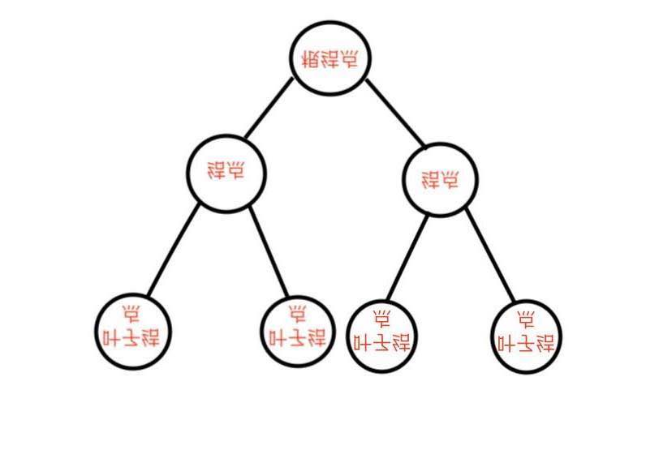

## 二叉树

### 树的概念
数据结构中的树可以看做是对现实世界中树的简化表达。

把树根抽象为`根结点`， 树枝抽象为`边`， 树的两端抽象为`结点`， 树的叶子抽象为`叶子结点`。

将上面现实中简化的树旋转以后就得到了计算机中的树的结构：
@TODO: 缺个图

计算机中的树有如下特点和重要概念： 
  - 树的层次计算规则： 根结点在的那一层记为第一层，其子结点所在的为第二层， 以此类推。（有的书中是从第0层开始算起，都可以，只要表明观点即可）
  - 结点和树的”高度“计算规则： 叶子结点的高度记为1，每向上一层高度增加1，逐层向上累加至目标结点时，所得到的值就是目标结点的高度。树中结点最大的高度，称为”树的高度“。
  - ”度“的概念： 一个结点开叉分出多少个子树，被记为结点的”度“。图中根结点的”度“为2。
  - ”叶子结点“：叶子结点就是度为0的结点。图中最后一层的结点的度为0，所以最后一层的结点称为”叶子结点“。

### 二叉树（binary tree）
什么是二叉树？

二叉树的定义是：二叉树是n个有限元素的集合，该集合或者为空、或者由一个称为根（root）的元素及两个不相交的、被分别称为左子树和右子树的二叉树组成，是有序树。当集合为空时，称该二叉树为空二叉树。在二叉树中，一个元素也称作一个结点。

